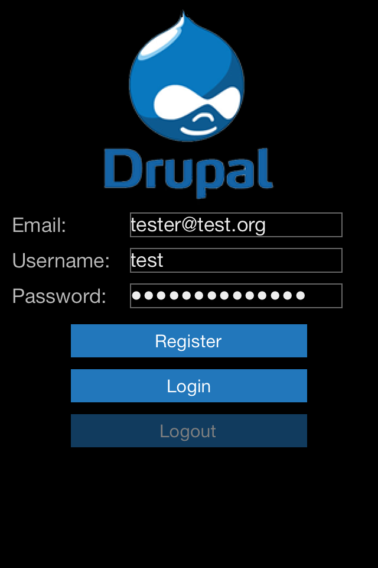

# To Run The App...

[TitaniumDrupalAdapter](https://github.com/jbeuckm/TitaniumDrupalAdapter) is a submodule of this repo. clone with --recursive to get the submodule code.

```
git clone git@github.com:jbeuckm/Ti-Drupal-Test-App.git --recursive
```

Rename `app/lib/drupal/config.js.example` to `app/lib/drupal/config.js` and enter the url of your Drupal 7 install and your Services 3.4+ REST/JSON endpoint.


# Jasmine

The included spec is intended to be run with [TiShadow](https://github.com/dbankier/TiShadow) + [Jasmine](https://jasmine.github.io/). 


